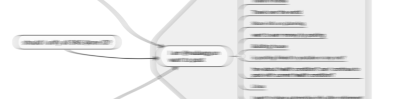

### BLOG ROADMAP
#### 2020
- Gatsby conversion from Jeykll - done
- Domain Registration
- Google Adsense
- Google Analytics / gtag - done
- Search Engine Optimazation - naver, google, bing, daum
- CMS integration  (is it really required? some doubt)
- Gallery

#### 2021
- Font update
- Naver blog link - done
- Multi-language-format-blog (Korean and English)
- 
### Feasibility check
- CMS adaptation (Contentful or other)  
- Useful plug-in adatpation  
- Markdown improvement    
- Software development process adaptation into blogging (Especially tracking system)  
- Darkmode adaptation  
- styled component or theme UI  
  
### Release plan & Bugfix
#### Baseline 1.0.0 (September 1st, 2020)
- Home photo  
- Unify google accounts used for blog purpose into one -done  
- Post page improvement  
- Photo page to be designed  
- Google analytics  
- Gatsby conversion  
- Search Engine Optimzation  
  
#### Baseline 1.2.0 (December 31th, 2020)
- Google Adsense  
  
#### Baseline 1.3.0	(January 31th, 2021)
- CMS adaptation done if required (dedending on feasibility check)  

### Posting plan
#### Posts – Raspberry pi related
- Raspberian installation preparation  
- Raspberian installation on macOS  
- Raspberian installation on Windows  
- Raspberian installation without monitor and keyboard  
- Raspberian installation with USB or external device  
- SSH port change  
- Linux basic command (ls, chmod, mount, umount, top, to be listed up, update, raspi-config)
- How to use VI editor
- Samba
- transmission
- automatic download of magnet with Flexget
- VNC and port forwarding
- Introduction to Docker
- How to install Docker
- Introduction to portainer
- Check NAS function with version management (git:sourcetree)
- Unifi controller in Docker
- Pihole in Docker
- Home assistant in Docker
- Home bridge in Docker
- Open media vault
- Comparison Raspbery pi 3B+/4B and NUC
- Kodi
- PM sensor with xiaomi gateway light
- Temperature check
- Security concept
- Auto mounting of HDD
- Phyton version change
- POE
- Fan controller on temperature in cable box
- Xiaomi lighting depending on dust level
- Hosting with GIT  
- Home control
- Media download as NAS
- IoT gateway
- Media player
- IP camera
- Unifi controller  