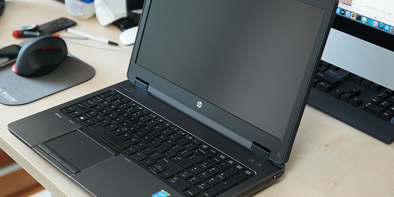
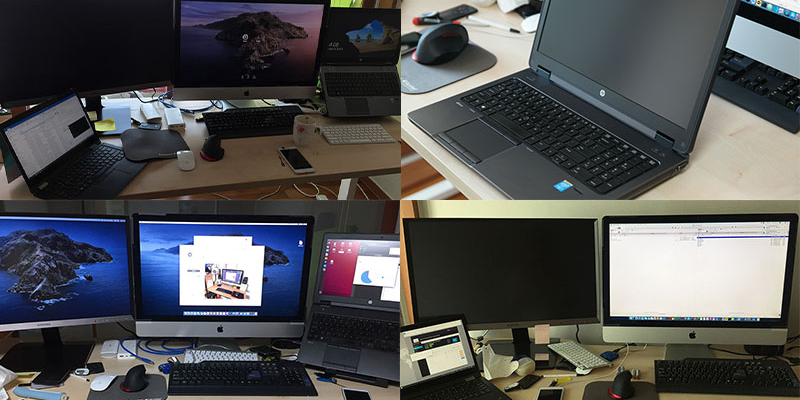

---

template: "post"
title: "HP zBook G2 를 보내며..."
cover: "../images/20200414-old-HP-left.png"
date: "2020-04-14"
slug: "Daily life 14.04.2020"
keywords: "Daily"
categories: 
    - Daily Life
tags:
	- HP zBook
language: Korean

---

## Daily Life - 14.04.2020
[COVID-19](https://g.co/kgs/m7R1Tu)로 인하여 일상 생활들이 많이 변하고 있다. 손싯기를 전보다는 더 자주 하며, 미세 먼지 많은 날 산책 할 때 사용하던 마스크를 외출 시, 사무실에서 항상 착용하게 되었으며, 노트북과 인터넷만 된다면 집에서 일할 수 있는 기회가 더 많이 생겼으며, 일상에서 많은 변화들이 찾아오고 있다.
	
인류의 역사를 보면 19세기 산업혁명이 시작되면서 부터 기존의 틀을 깨며 많은 것들이 순식간에 변하였지만 지금은 정말 순식간에 영원할 것만 같던 것들이 순식간에 사라지는 시대가 왔다. 
	
십년을 사용할 꺼라 다짐하며 구입했던 HP zBook G2를 정리하고 단촐하게 iMac만 사용하려 책상을 정리 했다. 

회사에서 ABS 어플리케이션 할 때 사용하던 zBook에 감동 받아 개인용으로 zBook G2를 구매하여 사용하다가 더 이상 하드웨어에 욕심 부리지 않기로 약속하며 좋은 곳으로 보냈다.

