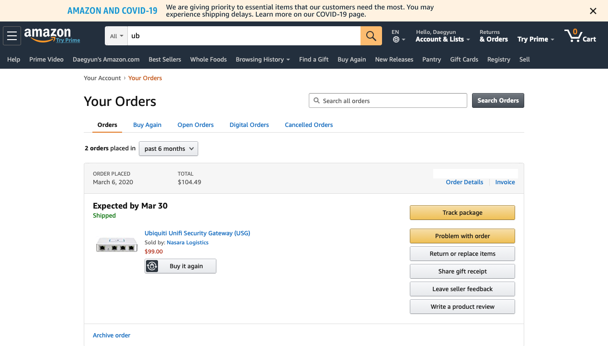

---

template: "post"
title: "직구-Amazon-Ubiquiti-Security-Gateway"
cover: "../images/20200415-COVER-purchase-amazon-USG.png"
date: "2020-04-15"
slug: "Purchase-amazon-USG"
keywords: "Purchase"
categories:
    - Purchase
    - Amazon
tags:
  - amazon
  - Ubiquiti
  - USG
language: Korean

---

## 직구 Amazon Ubiquiti Security Gateway
[Amazon](https://www.amazon.com)에서 [Ubiquiti Security Gateway](https://www.ui.com/unifi-routing/usg/)를 주문한지 벌써 한달 반이 지났다. COVID-19로 미국 국내 배송이 지연되고 있다고 안내는 나오나 기다림의 한계가 오가는 것 같다. 물론 99달러에 싸게 구입하여 참고 있지만, 한달 반동안 배송 중이라는 현실에 말문이 막힌다.

판매자에게 연락해도 답변도 없어서 판매자가 코로나에 감염되었나 하는 생각까지 들정도지만, 좋은 생각만 하기로 다짐한터라 더이상 생각하지 안기로 하였다.

어여 기다리던 USG를 설치하고 라즈베리도 NUC로 업글하고 집에 설치된 [UniFi Long Range Access Point](https://www.ui.com/unifi/unifi-ap-ac-lr/)와 iptime 공유기와의 부조합도 어여 끝내고 싶다.
