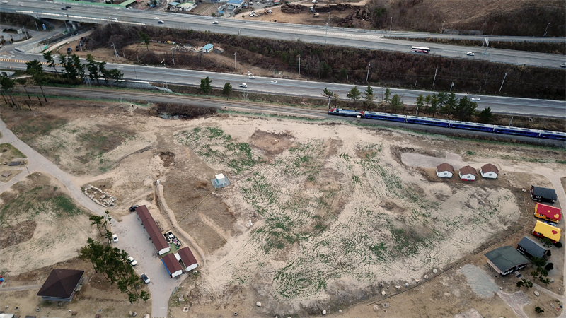
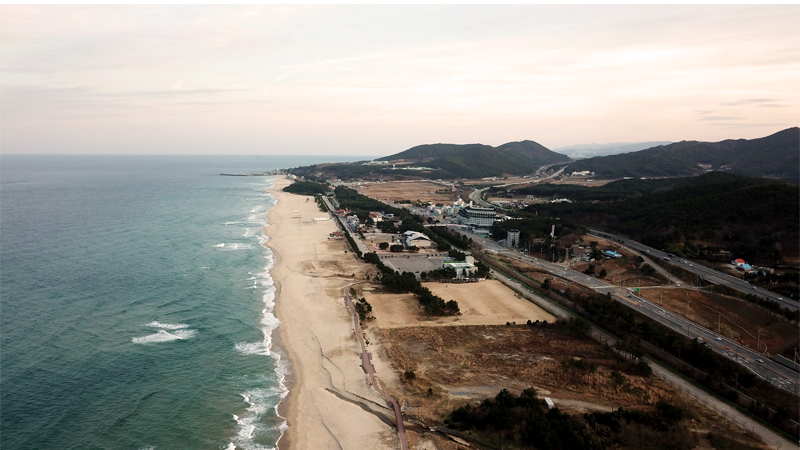

> Mangsang Auto Camping Repsort is closed on August 15th, 2020 in accordance with its restroration plan and the re-opening date will be announced later. The reason why Mangsang Auto Camping Resort is required to restore is that it was almost burned down by the forest fire last year.

 

[DONGHAE](http://www.dh.go.kr/english/) is located in the east region of South Korea and faces the east sea of Korea.

<iframe src="https://www.google.com/maps/embed?pb=!1m18!1m12!1m3!1d50634.723955662856!2d129.09308076070863!3d37.51569483062198!2m3!1f0!2f0!3f0!3m2!1i1024!2i768!4f13.1!3m3!1m2!1s0x3561b8acba2642e1%3A0xf1dbcfb3c0ba0027!2z6rCV7JuQ64-EIOuPme2VtOyLnA!5e0!3m2!1sko!2skr!4v1593847069507!5m2!1sko!2skr" width="600" height="450" frameborder="0" style="border:0;" allowfullscreen="" aria-hidden="false" tabindex="0"></iframe>
My first time to visit there was when I visited there to see one of my friends in the military in the summer of 1996. At that time I was a third-year-university-student wondering whether to join the military to take the military responsibility or to keep studying.As a Korean man it is still for us mandatory as responsibility of being Korean man to serve the army for about 2 years. It was for me 26 months. It is still difficulit for me to make a descion about right way in my life now as well as in the past.
 
 

 
Mangsang auto camping resort was almost burned down last year and left only a few facilities remaining.
 

 
All photos were taken by drone and approved by the miliary.
 

 

 

 

 

 

 

 

 

 

 

 

 

 

 

 

   
