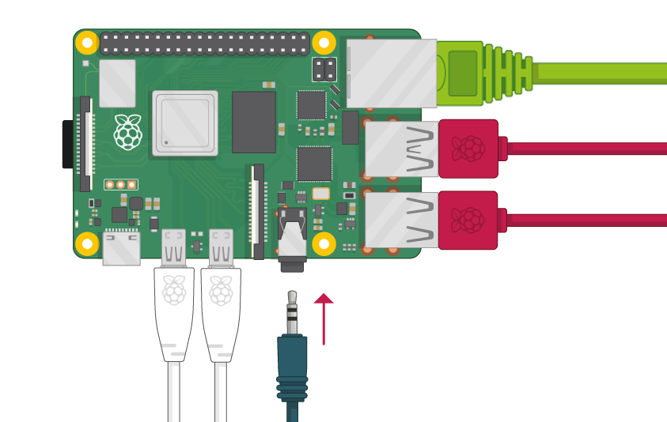
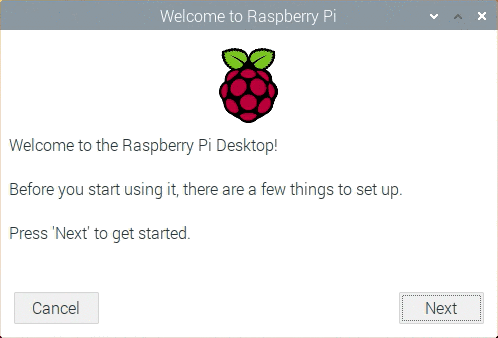

>라즈베리파이4B 모델에 라즈베리파이 OS를 설치하는 과정과 일상생활에서 사용하는 방법을 설명하고자 한다.

# 라즈베리파이
라즈베리파이는 싱글보드 컴퓨터로 영국 [라즈베리파이재단](https://www.raspberrypi.org)에서 학교와 개발도상국에서 기초 컴퓨터 과학의 교육 증진을 목표로 개발하였고 4세대 모델까지 출시 된 상태이다. 자세한 정보는 [라즈베리파이재단](https://www.raspberrypi.org/about/) 공식 홈페이지를 참조하기 바란다.
  

  
# 준비물
- 라즈베리파이
- 마이크로 SD 카드
- 모니터 (라즈베리파이 모델별로 지원하는 디스플레이 포트가 다르며 모델4는 미니 HDMI 모델3는 HDMI)
- 키보드 및 마우스
- 전원 (안정적으로 전원을 공급해야 동작에 문제 없음, 추천은 2.5A 이상되는 전원)
- 전원 케이블, 모니터 케이블, 랜 케이블
  
모니터, 키보드, 마우스 없이 라즈베리파이 OS 설치]도 가능하며 마이크로 SD 카드 대신 USB 저장 장치에 라즈베리파이 OS 설치도 가능하니 아래 포스트를 참고 바란다.
  
- [모니터, 키보드, 마우스 없이 라즈베리파이 OS 설치하기]()  
- [USB 저장 장치에 라즈베리파이 OS 설치하기]()  
  
# 라즈베리파이 OS 설치하기
사용하는 OS(Windows, macOS, Ubuntu)에 맞게 [Raspberry Pi Imager](https://www.raspberrypi.org/downloads/)를 설치하여 라즈베리파이 OS를 쉽게 설치 할 수 있다.

- Raspberry Pi Imager 설치
- 마이크로 SD 카드를 PC에 삽입
- Raspberry Pi Imager를 통해 라즈베리파이 OS 설치 (치과정에서 자동으로 마이크로 SD 카드 포멧이 진행된다.)

  
  
# 라즈베리파이 실행하기
- 라즈베리파이 OS가 설치된 마이크로 SD 카드를 라즈베리파이에 삽입한다.

- 마우스, 키보드, 모니터, 랜선를 연결한다.

- 전원을 연결한다.

- 전원을 연결 후 초기 세팅을 위해 재부팅이 일어 난 후 라즈베리파이 OS 데스크탑 화면이 보이면 성공이다.

- 그리고 국가설정, 비밀번호 설정, Wi-Fi 설정을 하고 OS 업데이트를 진행한다.

- 업데이트가 완료 되면 라즈베리파이 OS 설치 끝!  

