<br>

> VNC로 다른 PC에서 라즈베리파이에 원격 접속하여 모니터 없이 라즈베리파이4B 모델에 라즈베리파이 OS를 설치하는 과정을 소개하려 한다. VNC를 사용하기 위해서 라즈베리파이 OS 환경설정을 해야 하는데 모니터를 연결을 하지 않고 하려면 Putty로 VNC 및 부팅 옵션을 설정해 주어야 한다.
> 

<br>

# 라즈베리파이 OS 설치

[Raspberry Pi Imager](https://www.raspberrypi.org/downloads/)를 실행하여 라즈베리파이 OS를 마이크로 SD 카드에 설치한다.

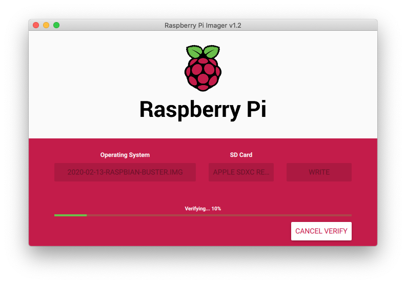

<br>

## 인터넷 설정
모니터 없이 라즈베리파이를 사용하려면 [SSH](https://en.wikipedia.org/wiki/Secure_Shell) 또는 [VNC](https://en.wikipedia.org/wiki/Virtual_Network_Computing)와 같은 원격 데스크탑 프로그램으로 다른 PC에서 원격 접속해야 한다. 앞으로 소개할 내용은 [realVNC viewer](https://www.realvnc.com/en/connect/download/viewer/)를 사용하여 라즈베리파이를 설정하도록 하겠다.

<br>

라즈베리파이는 유무선을 지원하기에 유선과 무선 두 가지 모두를 설명하겠다.

<br>

### 유선 설정
유선 연결을 위해 라즈베리파이 OS가 설치되어 있는 마이크로 SD 카드의 폴더로 이동한다.

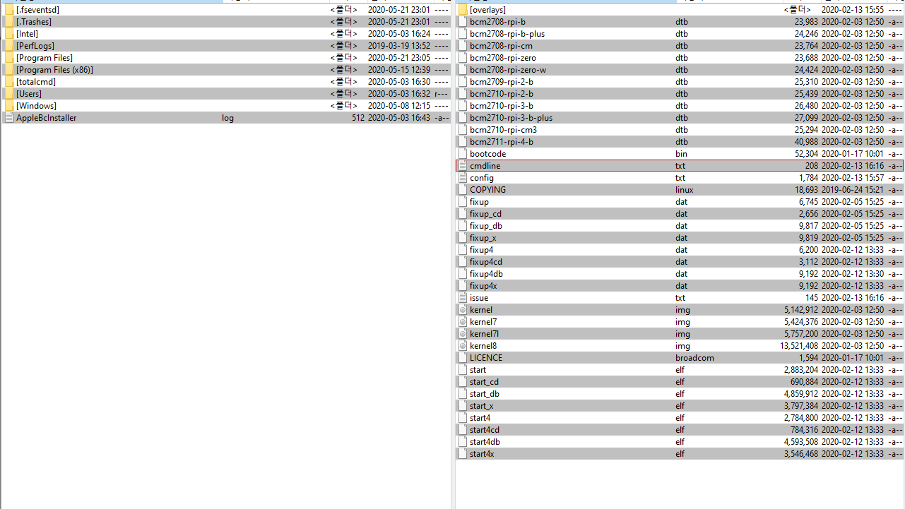

<br>

폴더에 있는 **cmdline.txt** 파일을 편집기로 맨 끝에 사용할 IP 주소를 입력한다.

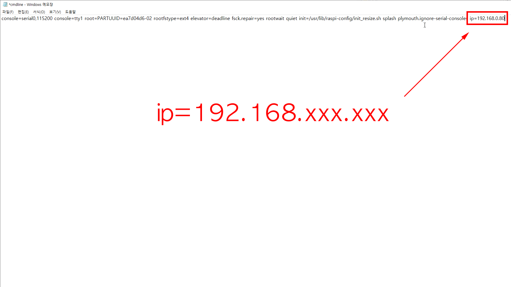

<br>

다른 기기에서 사용하고 있는 IP와의 충돌을 피하기 위해 IP를 입력해야 하며 유동 IP를 사용하고 싶으면 입력하지 않아도 되나 IP 확인에 어려움이 있으니 고정 IP를 사용하는 것이 편리하다.

<br>

### Wi-Fi 설정
Wi-Fi 연결을 위해서는 Wi-Fi의 정보를 입력해야 한다. 마이크로 SD 카드 폴더에 **wpa_supplicant.conf** 파일을 생성하고 다음과 같은 정보를 생성한 파일에 입력해 준다. Wi-Fi의 이름과 비밀번호 그리고 보안 설정을 입력한다.


```c
country=GB
ctrl_interface=DIR/var/run/spa_supplicant GROUP=netdev
updated_config=1
network = {
ssid="Wi-Fi 이름 입력"
psk="Wi-Fi 비밀번호 입력"
key_mgmt=WPA-PSK
}
```

<br>

## SSH 설정
인터넷 설정이 완료되면 다른 PC에서 라즈베리파이로 연결을 해야 하는데 보통 SSH 프로토콜을 이용하여 원격 접속하며 윈도우 OS에서는 [Putty](https://www.putty.org)로 연결을 한다. 라즈베리파이에 모니터가 연결되어 있다면 터미널에서 raspi-config 명령을 입력하고 SSH를 활성화시키면 되지만 지금은 강제로 SSH 활성화하는 방법을 소개하도록 하겠다.

<br>

마이크로 SD 카드 폴더에 **ssh** 이름으로 파일을 만들면 끝! 파일에 아무것도 쓸 필요도 없다.

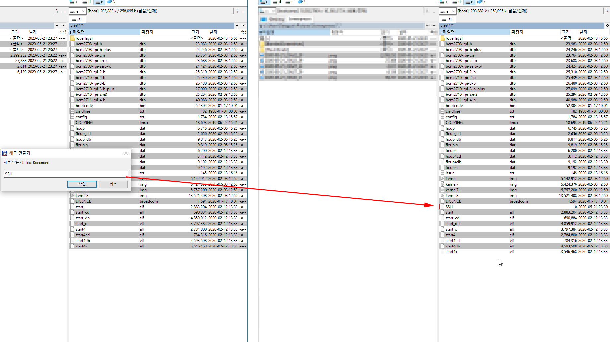

<br>

만약, **ssh** 파일을 만들어주지 않으면 Putty 연결 시 다음과 같은 오류가 발생하니 참고하기 바란다.

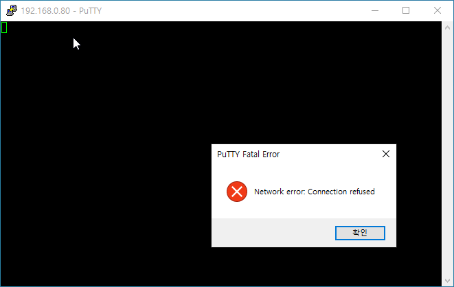

<br>

## Putty 원격 접속
이제 VNC 및 부팅 옵션을 변경하기 위해 [Putty](https://www.putty.org)로 라즈베리파이에 접속한다. [Putty](https://www.putty.org)는 리눅스나 유닉스 계열의 서버에 원격으로 접속할 수 있는 클라이언트 프로그램으로 무료로 다운로드할 수 있으며, 프로그램 또한 가벼워서 윈도우나 macOS에서 리눅스로 SSH 프로토콜을 이용하여 접속할 때 많이 사용한다.

<br>

Putty는 아래 링크에서 다운로드할 수 있다.

* [윈도우 용 putty 다운로드](https://www.putty.org)
* [macOS 용 putty 관련 정보](https://www.ssh.com/ssh/putty/mac/)


Putty 메인 화면에서 설정한 IP를 입력하고 port는 22 connection type은 SSH로 설정을 하고 연결한다.

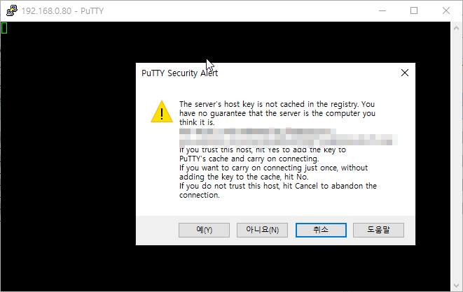

<br>

문제가 없으면 다음과 같은 화면이 보이며 확인을 누르면 Putty를 통해 라즈베리파이에 연결이 된다.

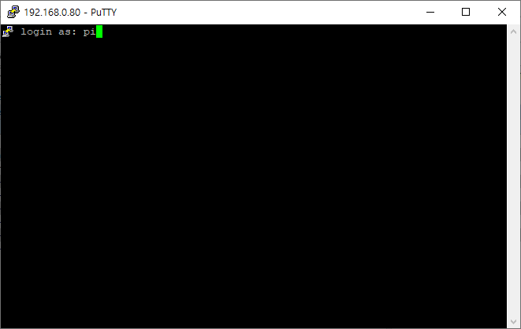

<br>

라즈베리파이의 초기 ID와 비밀번호는 다음과 같다.

```
ID: pi
Password: raspberry
```

<br>

로그인 후 VNC 및 부팅 옵션을 설정하기 위해 Putty에 다음과 같이 **sudo raspi-config**를 입력한다

```
sudo raspi-config
```

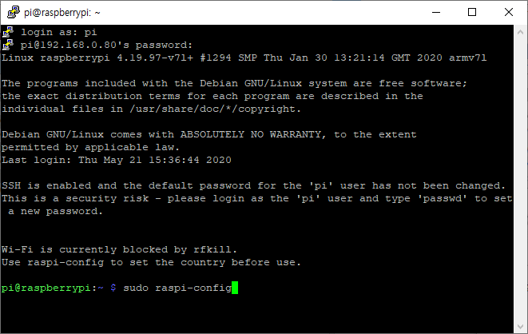

<br>

5.Interfacing options 선택 후

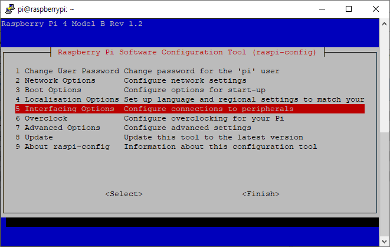

<br>

VNC 선택 후 활성화 선택

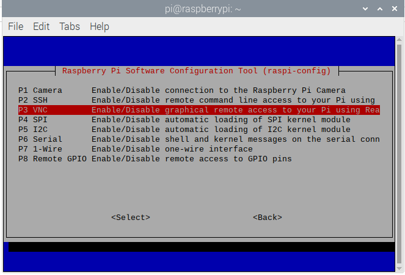

<br>

다음은 부팅 옵션 변경이다. 3 Boot options 선택 후

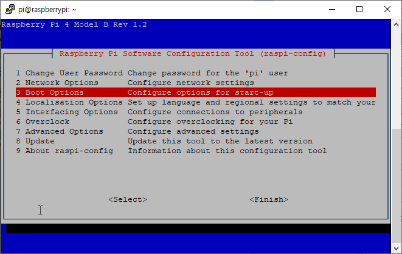

<br>

B1 Deskiptop / CLI 선택

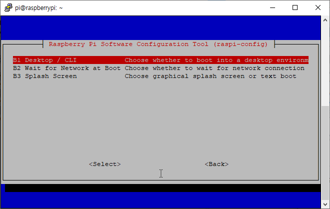

<br>

B4 Desktop Autologin Desktop 선택 후 OK 클릭

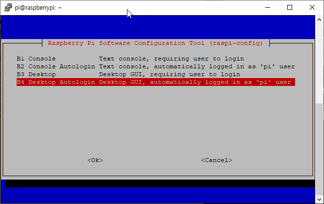

<br>

그러고 나서 재부팅 한다. 권한 문제로 재부팅이 안되면 sudo를 사용하여 재부팅한다.
재부팅! 권한 문제로 재부팅이 안되면 sudo를 사용하여 재부팅한다.

```
sudo reboot
```

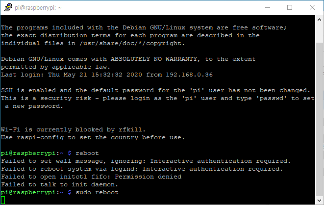

<br>

## VNC 접속
라즈베리파이의 IP를 입력하고 연결한다.

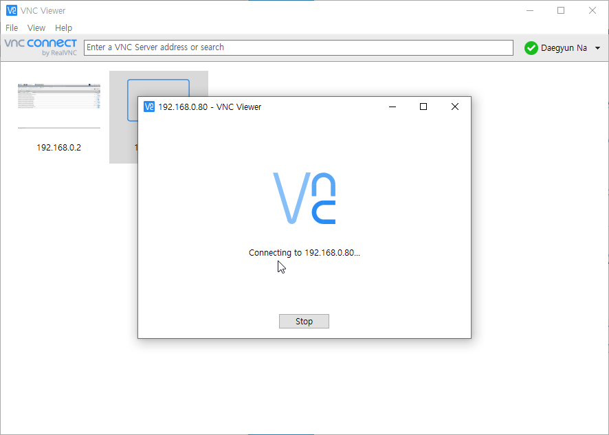

<br>

처음 연결하면 다음과 같은 보안 알림이 나온다.

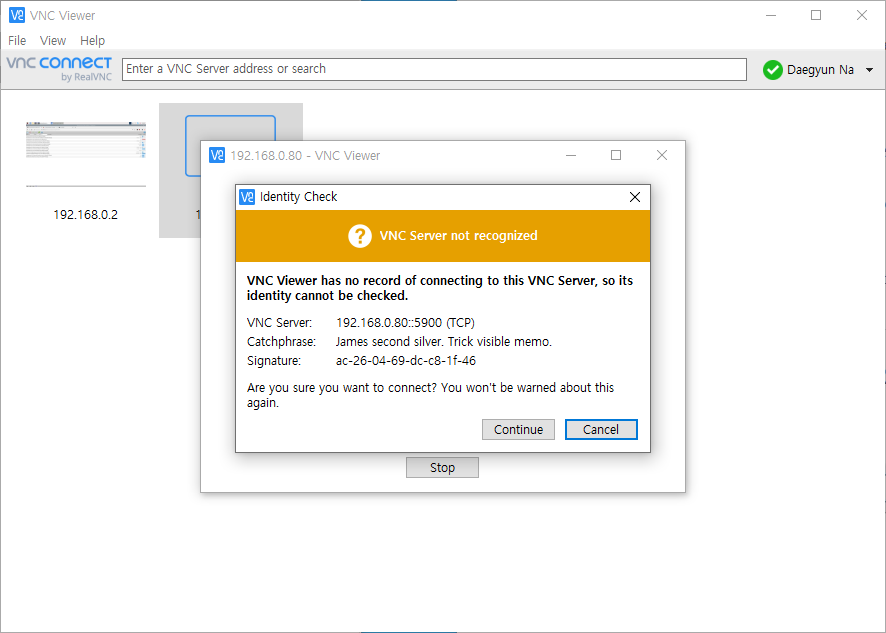

<br>

만약 부팅 옵션이 틀릴 경우 블랙 스크린만 보이는 경우도 있으니 접속 전 환경설정을 해야 한다.

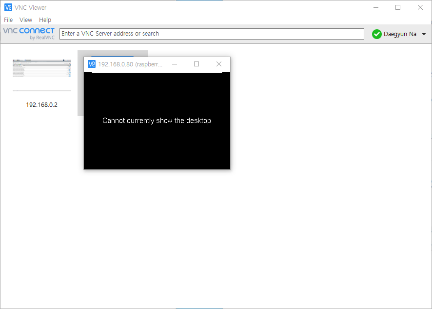

<br>

처음 라즈베리파이에 접속하면 보안을 위해 비밀번호 변경을 해야 하며 초기 세팅 및 소프트웨어 업데이트도 진행하게 된다.

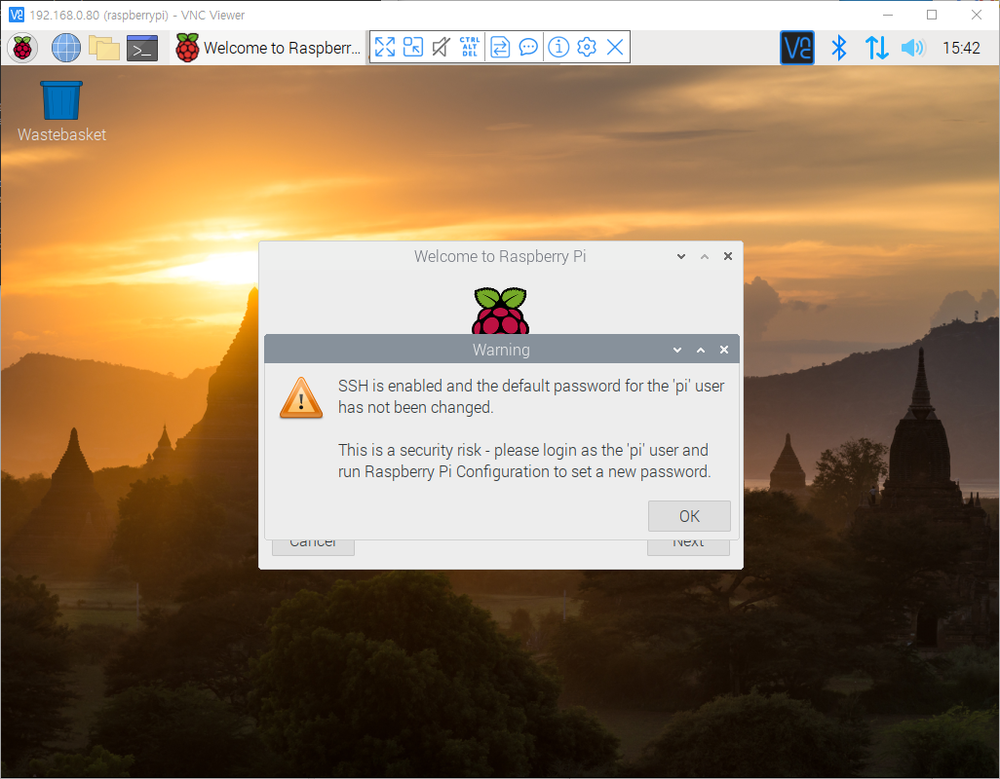

<br>

라즈베리파이 모델 3을 시작으로 3B 그리고 4B를 사용하면서 느낀 점은 설치가 점점 쉬어진다는 것이다. 시간이 지나면 윈도우 설치처럼 더 쉬워지지 않을까 싶다.