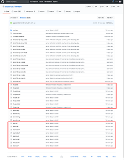

<br>
<br>

> 라즈베리파이는 기본적으로 SD카드로 부팅하지만 몇가지 환경설정에 의해 USB device boot, USB Mass Storage boot, Network boot도 할 수 있다. 이 포스팅에서는 실 사용이 많은 USB 메모리스틱이나 외장하드(HDD 또는 SSD)를 통한 부팅을 소개 하려 한다. 
> 
<br>


<br>
<br>

라즈베리파이는 여러가지 부팅 방법이 있고 이 포스트에서는 USB 포트를 통한 메모리스틱이나 외장하르로 부팅 하는 방법을 소개하려 한다. 라즈베리파이 모델 2B verion 1.2, 3B, 3B+와 4B는 USB포트를 통한 USB메모리 스틱이나 외장하드로 부팅이 가능하며 4B는 앞에 나열한 라즈베리파이 모델들과 다르게 보드에 내장되어 있는 EEPROM에 bootloader가 있어 설정하는 방법이 달다 각각 구분하여 설명하도록 하겠다.

<br>

라즈베리파이는 다음과 같은 부팅 모드를 제공한다.
* SD card boot
* USB device boot
* USB host boot
  * Mass storage boot
  * Network boot via ethernet
* GPIO boot

<br>

USB device boot는 라즈베리파이를 다른 PC에서 USB장치로 인식하게 하는 부팅 방법이며 USB host boot와는 다르다. 즉 다른 PC에 라즈베리파이를 USB로 연결하면 USB 저장장치와 같은 기기로 인식하게 하는 부팅모드이다. 앞서 말한 것과 같이 이 포스트에서는 USB hot boot 중 USB저장장치를 통해 부팅하는 방법을 설명하려 한다.

<br>

앞서 설명한 것과 같이 라즈베리파이 2B version 1.2 모델부터 3B+모델까지는 bootcode.bin 파일을 SD카드를 통해 라즈베리파이에 업로드를 진행하면 USB host boot가 가능해 지며 라즈베리파이 4B 모델은 EEPROM을 업데이트 해줌으로서 USB host boot가 가능해진다. 두가지 경우에 대해 설명하도록 하겠다.

<br>

# 라즈베리파이 2B ~ 3B+
라즈베리파이 2B ~ 3B+ 모델에서 USB host boot 모드로 변경하려면 [**bootcode.bin**](https://github.com/raspberrypi/firmware/raw/master/boot/bootcode.bin)를 다운로드하여 라즈베리파이에 업데이트 해주면 된다. 기존에는 여러가지 작업을 해야 했는데 라즈베리파이 재단에서 bootcode를 제공함으로서 쉽게 USB host boot 모드로 변경이 가능하게 되었다.

<br>

USB host boot모드로 변경하는 방법은 다음과 같다.

* SD카드를 FAT32로 포멧한다.
* [**bootcode.bin**](https://github.com/raspberrypi/firmware/raw/master/boot/bootcode.bin)을 다운로드 받아 포멧한 SD카드에 복사한다.
* 복사한 SD카드를 라즈베리파이에 삽입한다.
* 라즈베리파이를 부팅하면 bootcode.bin이 라즈베리파이로 업로드 된다.
* [Raspberry Pi Imager](https://www.raspberrypi.org/downloads/)로 USB메모리스틱이나 외장하드에 라즈베리파이 OS를 설치한다.
* 라즈베리파이 OS를 설치한 USB메모리스틱이나 외장하드를 라즈베리파이에 연결하고 라즈베리파이 전원을 켠다.
* 초기 설정을 위해 라즈베리파이를 재부팅해주고 나면 라즈베리파이를 사용할 수 있다.

<br>

## SD카드 포멧
SD카드를 준비하고 FAT32방식으로 포멧 한다.


<br>

## bootcode.bin 복사
포멧한 SD카드에 라즈베리파이 홈페이지에서 [**bootcode.bin**](https://github.com/raspberrypi/firmware/raw/master/boot/bootcode.bin)을 다운로드 받고 SD카드에 복사한다.


<br>

## USB host boot 설정
bootcode.bin 파일을 SD카드에 복사하고 라즈베리파이에 삽입한 후 라즈베피아이에 전원을 켜주면 USB host boot로 설정이 된다.

## Rasberry Pi imager로 라즈베피아이 OS 설치
[Raspberry Pi imager로 라즈베리파이 OS 설치편](/raspberry-pi-os-installation)을 참고하여 USB저장장치(메모리스틱이나 외장하드)에 라즈베리파이OS를 설치한다.

## USB저장장치 삽입 후 전원
라즈베리파이 OS가 설치된 USB저장장치를 라즈베리파이에 삽입 후 전원을 켜주면 USB저장장치에 라즈베리파이 OS 설치가 완료된다.

<br>

><br>
>
>다음은 라즈베리파이 4B 모델에 USB host boot모드를 설정하고 USB저장장치에 라즈베리파이OS를 설치하고 부팅하는 방법을 설명하겠다. 
>
><br>

<br>

# 라즈베리파이 4B
라즈베리파이 4B 모델은 보드에 있는 EEPROM에 부팅에 필요한 파일들이 있어 EEPROM 파일을 업데이트를 해주어야 USB host boot 모드가 가능 해진다. 다음 순서대로 업데이트를 진행하면 된다.

* SD카드에 라즈베리파이 OS 설치한다.
* SD카드로 부팅 후 라즈베리파이 OS를 최신으로 업데이트 한다.
* 업데이트 된 EEPROM 파일을 라즈베리파이 EEPROM에 업데이트 한다.
* [Raspberry Pi Imager](https://www.raspberrypi.org/downloads/)로 USB저장장치에 라즈베리파이 OS를 설치한다.
* 설치 후 Github에서 [Raspberry Pi firmware](https://github.com/raspberrypi/firmware/tree/master/boot)의 *.elf *.dat 파일을 다운로드 받아 라즈베리파이 OS가 설치된 USB저장장치에 덥어 씌운다.
* 라즈베리파이 USB포트에 라즈베리파이 OS가 설치된 USB저장장치를 삽입 후 전원을 켠다.

<br>

순서별로 자세히 설명하도록 하겠다.

<br>

## SD카드에 라즈베리파이 OS 설치
라즈베리파이 OS의 특정 폴더에 EEPROM 파일들이 있기 때문에 설치 후 업데이를 진행해야 한다. [Raspberry Pi imager로 라즈베리파이 OS 설치](/raspberry-pi-os-installation)편을 참고하여 라즈베리파이 OS를 SD카드에 설치하고 라즈베리파이를 부팅한다.

<br>

## 라즈베리파이 업데이트
최신 EEPROM 파일을 EEPROM에 업로드 하기 위해 라즈베리파이를 업데이트 한다.

```
sudo apt update
sudo apt full-upgrade
```

<br>

## bootloader 업데이트
stable version의 bootloader를 업데이트 하기 위해 vi 편집기로 firmware relese status를 crital에서 stable로 변경한다. vi 편집기 사용법은 [vi편집기 사용법]()을 사용하기 바란다.

<br>

``` 
sudo vi /etc/default/rpi-eeprom-update
```

<br>


<br>

변경 후 라즈베리파이의 다음 경로 (/lib/firmware/raspberrypi/bootloader/stable)에 최신 EEPROM 버전을 확인 후 다음 명령어를 터미널에 입력한다.


<br>

최신 버전은 2020-07-31 버전이며 새로운 버전이 배포되면 배포일자가 업데이트 될 것이니 최신 배포버전을 사용하도록 한다.

<br>

```
sudo rpi-eeprom-update -d -f /lib/firmware/raspberrypi/bootloader/stable/pieeprom-2020-07-31.bin
```

<br>

업데이트가 완료되면 재부팅하라는 메세지나 나온다.


<br>

재부팅 후 bootloader의 version 및 config을 다음 명령어로 확인 할 수 있다.

```
vcgencmd bootloader_version 
```

다음과 같이 업데이트한 버전 정보가 나온다.


<br>

마찬가지로 USB로 부팅이 세팅 되었는지 다음 명령어를 터미널에 입력한다.

```
vcgencmd bootloader_config
```

BOOT_ORDER 값이 0xf41면 USB로 세팅 된 것이다. 다음 스크린샷 참조하기 바란다.


<br>

Version과 Config가 확인되면 라즈베리파이를 shutdown하고 SD카드를 분리한다.

<br>

## USB저장장치에 라즈베리파이 OS 설치
[Raspberry Pi imager로 라즈베리파이 OS 설치](/raspberry-pi-os-installation)편을 참고하여 USB저장장치에 라즈베리파이 OS를 설치한다.

<br>

## USB저장장치 부팅가능하게 만들기
라즈베리파이 OS 설치가 완료 후 Github에서 최신의 [Raspberry Pi firmware](https://github.com/raspberrypi/firmware)를 다운로드 받고  boot폴더에 있는 *.elf *.dat 파일들을 USB저장장치에 덮어씌우기 하면 USB저장장치로 부팅이 가능해진다.

<br>



<br>

## USB저장장치 삽입 후 전원
라즈베리파이 OS가 설치된 USB저장장치를 라즈베리파이에 삽입 후 전원을 켜주면 설치 끝. 

<br>

라즈베리파이 3B+를 우연히 회사에서 시뮬레이션용도로 사용하면서 라즈베리파이를 접하게 되었고 집에서 사용하던 홈네트워크 시스템과 NAS 및 IoT용도로 라즈베리파이를 사용하고 있는데 효율면에서 만족하고 사용하고 있다. 아파트 단자함에 라우터, 허브, 외장하드, 라즈베리파이를 설치하여 사용 중인데 내가 사용하는 목적에 가장 적합한 제품인 듯하다.


<br>

> <br>
> USB저장장치에 OS를 설치하고 사용하면 SD카드 대비 속도가 빠르다고 한다. 무엇보다도 집에 굴러다니는 USB메모리스틱이나 외장하드를 사용할 수 있다는 장점이 있는 것 같다. 라즈베리파이의 속도에 대한 체감은 메모리 업그레이드 인 듯하다. 지금 사용하는 모델은 4B 4기가이고 NAS, Transmssion, Docker, Unifi controller, Home Assistant와 같은 IoT에 사용 중이다. 가끔 Transmission에서 다운받아진 영화를 메인 PC로 옮길 때 매우 느려지기도 하지만 효율성에서 접근하면 무난 한 듯 하다. SD카드에 OS를 설치해서 사용했을 때도 SD카드 고장으로 재 설치 한 적도 없고..
> 
><br>
><br>
> 
> 하고 싶은 말은 본인이 원하는대로 하면 된다.!
><br>
><br> 


